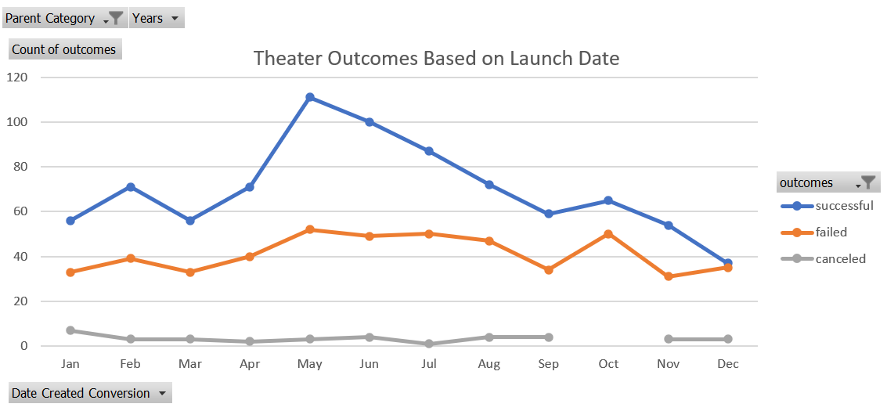
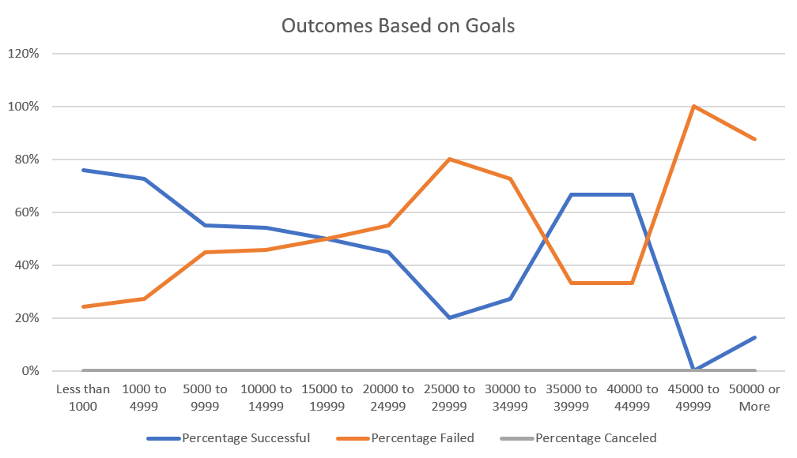

# An Analysis of Kickstarter Campaigns

## Overview 

In this project, we are helping Louise understand how different campaigns fared in relation to their launch dates and their funding goals. This is all to visualize campaign performances to improve decision making. To help Louise, we conducted our analysis by creating and utilizing multiple tools on Excel. Through these tools we gathered, organized, and displayed data to determine why campaigns succeeded, failed or got canceled.

## Analysis and Challenges

The first deliverable was to find the outcomes based on launch dates. To find the initation of these projects we needed more data, so we added a "Year" column to the sheet to later have the ability to see the monthly performance in any given year. Then by using a pivot table, we organized our information to identify the total amount of outcomes of these campaigns at every month throughout Louise's lifetime. To better understand which months performed better, we created a line chart  from the table to organize the data in a much more visual way. As you can see from the chart below, "Theatre Outcomes Based on Goals", we can see the amount of different outcomes per month from all years. 

The second deliverable was to find the outcomes based on goals for plays. We conducted this analysis by creating a range of the amount of goal money, identifying the outcomes from these ranges, and then putting these numbers into percentages. To find the outcomes based on the goal

## Results

From our results on the "Theatre Outcomes Based on Goals" chart, it is clear that in May and June, theater campaigns had much more success. We can also conclude that December had the least amount of succesful campaigns and almost had as many failed projects. Based on this, we recommened Louise to continue launching theatre campaigns in the months of May and June and not start them in December. For the "Outcomes Based on Goals" chart, we can conclude that plays that have a goal of less than a $1,000 tend to have more success. With a success rate of 76%, we suggest Louise to have a lower goal to ensure a higher number of achievable plays.

